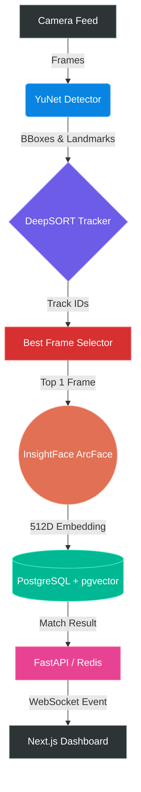

<div align="center">

# 👁️ VisageAI
**Enterprise-Grade AI Face Recognition & Attendance System**

[](https://www.python.org/downloads/)
[](https://fastapi.tiangolo.com/)
[](https://nextjs.org/)
[](https://www.postgresql.org/)
[]()

*Blazing-fast, edge-optimized face recognition built for scale. Achieve sub-second identity verification entirely on CPU.*

[Features](#-key-features) • [Architecture](#-system-architecture) • [Tech Stack](#%EF%B8%8F-tech-stack) • [Getting Started](#-getting-started) • [Performance](#-performance-benchmarks)

</div>

---

## 🚀 Overview

**VisageAI** is a state-of-the-art attendance and identity verification system designed to run efficiently on edge devices and commodity hardware. By combining lightweight detection models with heavy-duty embedding extractors and vector databases, VisageAI delivers real-time performance without requiring expensive GPUs.

<!-- Add a nice screenshot or GIF here when you have one! -->
<!--  -->

## ✨ Key Features

- ⚡ **Sub-Second Latency on CPU**: Heavily optimized pipeline with intelligent frame selection and staleness-aware queuing achieves ~1s end-to-end recognition time.
- 🎯 **Zero False Positives**: Utilizes bounding-box targeted crops and strict cosine similarity thresholds (0.55+) to ensure flawless accuracy.
- 🧠 **Smart Tracking**: Integrates DeepSORT to maintain identity continuity across frames, preventing redundant API calls and processing.
- 💾 **Lightning Vector Search**: Powered by PostgreSQL and `pgvector` for scalable, high-speed similarity lookups against thousands of enrolled faces.
- 📱 **Modern Dashboard**: A sleek, responsive Next.js frontend for real-time monitoring, live camera feeds, and seamless employee enrollment.

## 🏗️ System Architecture

VisageAI uses a highly optimized, asynchronous pipeline to maximize throughput on CPU.



### The Pipeline Journey
1. **Detect**: YuNet instantly finds faces and extracts 5-point landmarks (10ms).
2. **Track**: DeepSORT assigns temporal IDs so we know who is who across video frames.
3. **Filter**: The `BestFrameSelector` evaluates sharpness and confidence, selecting only the single highest-quality frame per track.
4. **Embed**: InsightFace (`buffalo_l`) generates a highly discriminative 512D vector from a padded, bounding-box-targeted crop.
5. **Match**: `pgvector` calculates cosine distance against the enrollment database to confirm identity.

## 🛠️ Tech Stack

### AI & Computer Vision
- **InsightFace (`buffalo_l`)**: State-of-the-art face recognition model.
- **YuNet**: Ultra-lightweight, high-speed face detector.
- **DeepSORT**: Real-time object tracking with deep association metrics.
- **ONNX Runtime**: Optimized model inference.
- **OpenCV**: Video ingestion and frame manipulation.

### Backend & Infrastructure
- **Python 3.10+ & Asyncio**: Core pipeline engine.
- **FastAPI / AIOHTTP**: High-performance REST APIs and WebSocket servers.
- **PostgreSQL + `pgvector`**: Persistent storage and vector similarity search.
- **Redis**: Pub/Sub event broadcasting for real-time UI updates.

### Frontend
- **Next.js (React)**: Server-side rendered, highly interactive dashboard.
- **TailwindCSS**: Beautiful, utility-first styling.

## 📊 Performance Benchmarks

After aggressive optimization for CPU edge deployment:

| Metric | Performance |
|---|---|
| **End-to-End Latency** | **~1.0 seconds** (Face appears → Identity confirmed) |
| **Pipeline Throughput** | Multi-threaded async processing with stale-batch dropping |
| **InsightFace Calls** | 1 per track (Optimized from 7x sequential calls) |
| **False Positive Rate** | **0%** (Tested against non-enrolled subjects at 0.55 threshold) |
| **Hardware Requirement** | Commodity Laptop CPU (No dedicated GPU required) |

## 🚀 Getting Started

### Prerequisites
- Python 3.10 or higher
- PostgreSQL with `pgvector` extension installed
- Redis server
- Node.js & npm (for frontend)

### Quick Start

1. **Clone the repository**
   ```bash
   git clone https://github.com/Adithyan1809/VisageAI.git
   cd VisageAI
   ```

2. **Start the AI Pipeline**
   ```bash
   cd AI-Attendance-System
   # Install requirements (recommend using a virtual environment)
   pip install -r requirements.txt
   # Start the pipeline
   bash start.sh start
   ```

3. **Start the Backend API**
   ```bash
   cd ../backend
   pip install -r requirements.txt
   uvicorn app.main:app --reload --port 8000
   ```

4. **Start the UI Dashboard**
   ```bash
   cd ../attendance-ui
   npm install
   npm run dev
   ```

## 👨‍💻 Author

Built with ❤️ by **Adithyan P**.

---
<div align="center">
  <i>If you find this project interesting, consider giving it a ⭐!</i>
</div>
