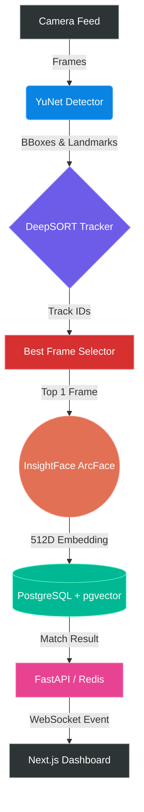

<div align="center">

# 👁️ VisageAI
**Enterprise-Grade AI Face Recognition & Attendance System**

[](https://www.python.org/downloads/)
[](https://fastapi.tiangolo.com/)
[](https://nextjs.org/)
[](https://www.postgresql.org/)
[]()
[]()

*Blazing-fast, edge-optimized face recognition built for scale. Achieve sub-second identity verification entirely on CPU.*

[Features](#-key-features) • [Architecture](#-system-architecture) • [Tech Stack](#%EF%B8%8F-tech-stack) • [Auth System](#-authentication-system) • [Getting Started](#-getting-started) • [Performance](#-performance-benchmarks)

</div>

---

## 🚀 Overview

**VisageAI** is a state-of-the-art attendance and identity verification system designed to run efficiently on edge devices and commodity hardware. By combining lightweight detection models with heavy-duty embedding extractors and vector databases, VisageAI delivers real-time performance without requiring expensive GPUs.

The admin dashboard is protected by an **industry-grade JWT authentication system** — the same pattern used by companies like Stripe, AWS, and GitHub.

## ✨ Key Features

- ⚡ **Sub-Second Latency on CPU**: Heavily optimized pipeline with intelligent frame selection and staleness-aware queuing achieves ~1s end-to-end recognition time.
- 🎯 **Zero False Positives**: Utilizes bounding-box targeted crops and strict cosine similarity thresholds (0.55+) to ensure flawless accuracy.
- 🧠 **Smart Tracking**: Integrates DeepSORT to maintain identity continuity across frames, preventing redundant API calls and processing.
- 💾 **Lightning Vector Search**: Powered by PostgreSQL and `pgvector` for scalable, high-speed similarity lookups against thousands of enrolled faces.
- 📱 **Modern Dashboard**: A sleek, responsive Next.js frontend for real-time monitoring, live camera feeds, and seamless employee enrollment.
- 🔐 **Enterprise Auth**: Full JWT + Refresh Token authentication with bcrypt, account lockout, token rotation, and httpOnly cookies.

## 🏗️ System Architecture

VisageAI uses a highly optimized, asynchronous pipeline to maximize throughput on CPU.



### The Pipeline Journey
1. **Detect**: YuNet instantly finds faces and extracts 5-point landmarks (10ms).
2. **Track**: DeepSORT assigns temporal IDs so we know who is who across video frames.
3. **Filter**: The `BestFrameSelector` evaluates sharpness and confidence, selecting only the single highest-quality frame per track.
4. **Embed**: InsightFace (`buffalo_l`) generates a highly discriminative 512D vector from a padded, bounding-box-targeted crop.
5. **Match**: `pgvector` calculates cosine distance against the enrollment database to confirm identity.

## 🔐 Authentication System

VisageAI uses a **production-grade, stateless JWT authentication** system — the same dual-token pattern used in enterprise software.

### How It Works

```
[Browser] → POST /api/auth/login (username + password)
              ← { access_token (15 min JWT) } + Set-Cookie: refresh_token (httpOnly, 7d)

[Browser] → GET /api/* with Authorization: Bearer <access_token>
              ← 200 OK

[Browser] → POST /api/auth/refresh (cookie sent automatically)
              ← { new access_token }   [Refresh Token Rotation]

[Browser] → POST /api/auth/logout
              → refresh token revoked in DB, cookie cleared
```

### Token Strategy

| Token | Lifetime | Storage | Security |
|---|---|---|---|
| Access Token (JWT) | 15 minutes | React state (memory only) | Never touches disk — XSS-safe |
| Refresh Token | 7 days (30 if "remember me") | `httpOnly` cookie | JS cannot read it — XSS + CSRF-safe |

### Security Features

| Feature | Implementation |
|---|---|
| Password hashing | bcrypt cost=12 |
| Token storage | Access token in memory only |
| Refresh token rotation | New token on every refresh; old one revoked in DB |
| Token reuse detection | Replayed revoked token → all sessions revoked immediately |
| Account lockout | 5 failed logins → 15-minute lockout (tracked in PostgreSQL) |
| httpOnly cookie | Refresh token inaccessible to JavaScript |
| Audit log | IP address + User-Agent stored with every refresh token |
| Token revocation | SHA-256 hash of token stored in DB (never raw token) |

### Admin Roles

| Role | Access |
|---|---|
| `SUPER_ADMIN` | Full access, can manage other admins |
| `ADMIN` | Full operational access |
| `VIEWER` | Read-only access |

### Creating Admin Accounts

```bash
cd backend
./venv/bin/python -m app.auth.seed \
  --username admin \
  --password "YourSecurePass@123" \
  --email "admin@company.com" \
  --full-name "System Administrator"
```

### Protecting Backend Routes

```python
from app.auth.dependencies import get_current_user, require_admin

# Require any valid login:
@router.get("/my-route")
def my_route(user = Depends(get_current_user)):
    ...

# Require ADMIN or SUPER_ADMIN role:
@router.delete("/sensitive")
def sensitive(user = Depends(require_admin)):
    ...
```

## 🛠️ Tech Stack

### AI & Computer Vision
- **InsightFace (`buffalo_l`)**: State-of-the-art face recognition model.
- **YuNet**: Ultra-lightweight, high-speed face detector.
- **DeepSORT**: Real-time object tracking with deep association metrics.
- **ONNX Runtime**: Optimized model inference.
- **OpenCV**: Video ingestion and frame manipulation.

### Backend & Infrastructure
- **Python 3.10+ & Asyncio**: Core pipeline engine.
- **FastAPI**: High-performance REST APIs and WebSocket servers.
- **PostgreSQL + `pgvector`**: Persistent storage and vector similarity search.
- **Redis**: Pub/Sub event broadcasting for real-time UI updates.
- **SQLAlchemy**: ORM for data models.
- **python-jose + passlib[bcrypt]**: JWT signing and password hashing.

### Frontend
- **Next.js 14 (React)**: Server-side rendered, highly interactive dashboard.
- **TailwindCSS**: Beautiful, utility-first styling.
- **Framer Motion**: Smooth page transitions and micro-animations.
- **Axios** with request interceptors: Auto-attaches JWT headers and silently refreshes on 401.

### Auth Architecture
- **Dual-token pattern**: Short-lived JWT (15 min) + long-lived httpOnly refresh cookie (7 days).
- **React AuthContext**: Access token stored in-memory only — never `localStorage`.
- **Silent refresh**: Proactively renews token 1 minute before expiry with no user interruption.

## 📊 Performance Benchmarks

After aggressive optimization for CPU edge deployment:

| Metric | Performance |
|---|---|
| **End-to-End Latency** | **~1.0 seconds** (Face appears → Identity confirmed) |
| **Pipeline Throughput** | Multi-threaded async processing with stale-batch dropping |
| **InsightFace Calls** | 1 per track (Optimized from 7x sequential calls) |
| **False Positive Rate** | **0%** (Tested against non-enrolled subjects at 0.55 threshold) |
| **Hardware Requirement** | Commodity Laptop CPU (No dedicated GPU required) |

## 🚀 Getting Started

### Prerequisites
- Python 3.10 or higher
- PostgreSQL with `pgvector` extension installed
- Redis server
- Node.js & npm (for frontend)

### Quick Start

1. **Clone the repository**
   ```bash
   git clone https://github.com/Adithyan1809/VisageAI.git
   cd VisageAI
   ```

2. **Configure the Backend**
   ```bash
   cd backend
   python -m venv venv && source venv/bin/activate
   pip install -r requirements.txt
   ```
   
   Create `backend/.env`:
   ```env
   JWT_SECRET_KEY=<run: python3 -c "import secrets; print(secrets.token_hex(32))">
   JWT_ALGORITHM=HS256
   ACCESS_TOKEN_EXPIRE_MINUTES=15
   REFRESH_TOKEN_EXPIRE_DAYS=7
   ```

3. **Seed the first admin account**
   ```bash
   python -m app.auth.seed --username admin --password "Admin@1234" --email "admin@company.com"
   ```

4. **Start the Backend API**
   ```bash
   uvicorn main:app --host 0.0.0.0 --port 8080
   ```

5. **Start the AI Pipeline**
   ```bash
   cd ../AI-Attendance-System
   pip install -r requirements.txt
   bash start.sh start
   ```

6. **Start the UI Dashboard**
   ```bash
   cd ../attendance-ui
   npm install
   npm run dev
   ```

7. **Login**
   
   Open `http://localhost:3000/login` and sign in with your admin credentials.

## 👨‍💻 Author

Built with ❤️ by **Adithyan P**.

---
<div align="center">
  <i>If you find this project interesting, consider giving it a ⭐!</i>
</div>
